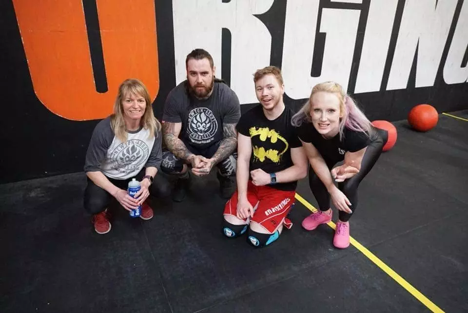
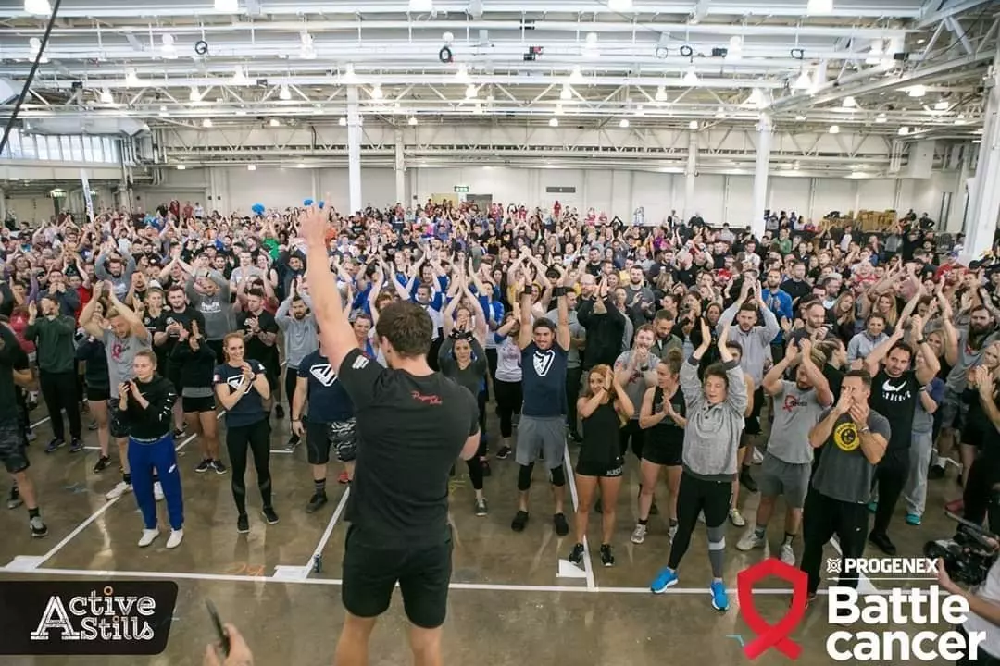

> "It's a social experience like no other where no one judges and everyone encourages progression."

A memory popped up on Facebook today and it's reminded me why I joined Crossfit. I initially joined because I was unhappy with my weight. I got to 16st (~101kg) and I was feeling slightly unhappy with my weight gain. It's not a huge amount of weight compared to other's, but it was my heaviest weight. Also, posture was a biggie for me, I have Anterior Pelvic Tilt (or APT) and I walked with a bounce.

4 months in and I could already see a huge improvement, I was eating more healthy meals and the weight started shedding off. Since then, Crossfit has become a huge part of my life. I've entered many competitions, raised money for good causes and gained good friendships out of the experience. If anyone has ever wondered whether they should join a Crossfit box, then I 100% recommend it. It's a social experience like no other where no one judges and everyone encourages progression.

Another positive side-effect is that it's really helped with my anxieties. I feel more positive within myself and feeling stronger every day is amazing, what's not to like about that?

3 years of Crossfit

    
Competition in Plymouth
    

    
Raising money for cancer
    

    
Local Crossfit competition at Newton Abbot Crossfit
    

    
The community is amazing. And we were all there to raise money for cancer.
