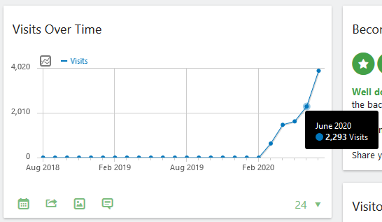
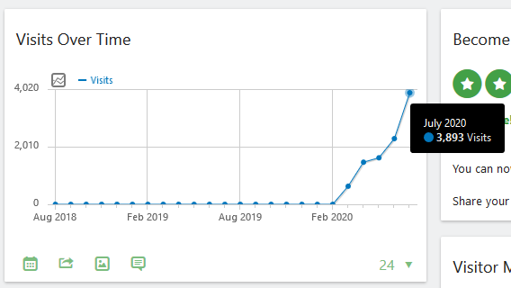
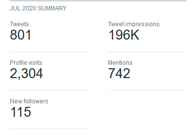

Last week I checked my website's analytics and took a lot at how many views I had compared to the previous months. I was genuinely surprised that I managed to gain over 3,000 views, and the jump between the previous month was 1,600 difference.

It's so big that I thought I'd make a post on how I managed to grow my blog over time. Please also be aware that I have been a blogger on and off for over ten years, so the views over time aren't extraordinary compared to other bloggers, but it is a noteworthy achievement.

## How did I build up my views?

Last month, I focused on building my social followers. I updated my [Facebook page](https://www.facebook.com/MBrooksDeveloper), Tweet more on [Twitter](https://twitter.com/mbrooksuk). My blog posts have been imported into my [Medium profile](https://medium.com/@Mike_D_Brooks) and also posted to my [Coil profile](https://coil.com/u/MichaelBrooks). Last month was also my first full month of weekly posting to my [Substack newsletter](https://michaelbrooks.substack.com/), and even though I don't think Substack affected my website views, it's helped me grow a tight-knit community. If you're not sure what any of these social networks are, or you're not sure how to utilise them, don't worry, I'll explain that now.

I haven't focused on growing [my LinkedIn](https://www.linkedin.com/in/-michaelbrooks/) connections, but I have started converting my blog posts into LinkedIn articles. No one from LinkedIn has been signed up to my newsletter subscribers or viewed my website. Because of this, I don't think it's worth writing about today.

## How I use my Facebook page

For my Facebook page, I'm not sure how many people are people I don't know vs friends who have liked my page. However, I decided to go to ham on the invite button and invite everyone on my friend's list, which has helped me from 138 to 142-page likes. I think a handful of those likes have clicked to view my website at some point.

I've mostly been sharing my newsletter posts instead of my blog posts on Facebook, which means most views won't actually be coming from here unless they click on about section which most users won't do.

## How I use my Twitter profile

Twitter is, by far, my most used social network. It's incredible how you can find so many amazing people and connect with them. I follow people I find interesting and join in their conversations when I feel if the right moment.

Most of my interaction is liking and retweeting, which I think if you're just starting, it won't be the best strategy. I feel the best approach is searching for interesting topics, and join in the conversation.

Every so often I'll chuck in a hashtag or two, but I don't focus on hashtags. I'll mostly focus on following and connecting with new and current people within my network. Be yourself and don't seek out to be something you're not. If you try to be fake, people will know, and they will call you out for it.

Medium is excellent as an additional source for your blog posts. If you haven't signed up, I would recommend you do it now and join the partner platform. Once you're on the partner platform, you will get revenue based on a reader's read time. The longer you can keep them interested in your post, the more money you can make from them.

My strategy is importing my posts into a Medium story, which will add a canonical link back to your original blog post, and have a link in the footer which says "Originally published at [https://michaelbrooks.co.uk](https://michaelbrooks.co.uk "https://michaelbrooks.co.uk")". I've joined a couple of Medium groups and participate in any posts where possible.

## How I use Coil

This is where I believe most of my new traffic has come from, and I connected my blog to their payments system so I could receive support from their readers, and linked my latest posts to my profile page. A couple of my posts have been featured on their community-supported section which I'm proud of, and the community on Coil has been very welcoming, and I've connected to a few people from here on Twitter.

If you haven't done so, I recommend you take a look at Coil's website and sign up. If you're wondering how much I made from here last month, it was around 10 pence, which isn't a huge amount, but it's better than nothing, and it helps keep me going.

## How I use Substack

My latest blog posts are also created as a newsletter post. Honestly, I'm not sure how long I'll carry on doing this for as I'm thinking of changing the format of this. What I might do is create links to my latest articles which will be posted to my blog, and new sections such as what I'm currently reading, what I'm listening to and who I've found interesting this week.

If this sounds like something you'd be interested in, then please leave a comment down below, and I'd love to read it. Alternatively, you can @ or dm me on Twitter, Facebook, wherever takes your fancy.

## Bonus: How I use Hacker News

Hacker News or HN as others like to call it is a great community of developers, creators and business owners. They offer a lot of advice and support, and overall they're a fantastic community. I've posted a few milestones and updates on there, and have received comments, views and new followers.

I decided to create a new group called "Creator interviews" which anyone can contribute to, but so only I have added content there. I have also linked to my blog where I deemed it was helpful for the topic at hand, and I think this has helped me gain extra viewers on my blog.

## Conclusion

That's pretty much how I use the plethora of social networks, and I'm constantly exploring new avenues and seeing what works, and what doesn't. As always, you're more than welcome to comment below and subscribe to my newsletter if you haven't done so already.