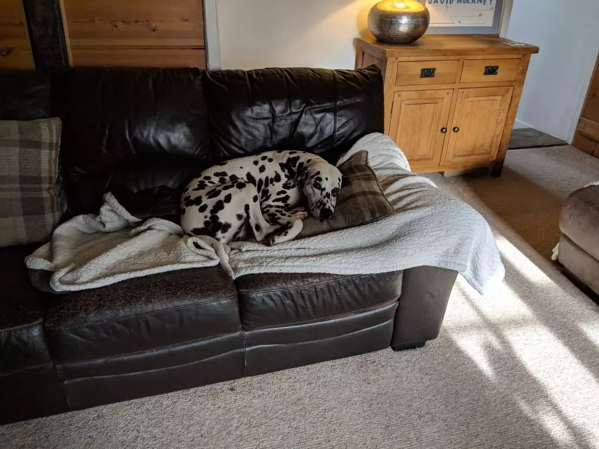

Today is our final day in February, and although it's our shortest month, it definitely feels like our longest. I've managed to retain my internet connections and make many more. This month I managed to hit 3,000 followers which is a nice achievement.

## Alien Ant Farm and POD live

My wife, sister-in-law and I went to see Alien And Farm and POD last night which was fantastic. We only recognised two AAF songs, but they were great performers. They interacted with the crowd and teased their Michael Jackson's cover of Smooth Criminal. They basically started shouting "Eddy... Eddy... Eddy are you okay? Are you okay Eddy" mentioned they would play a cover and asked if that was okay, and then proceeded with a different cover song. They then played another one of their songs before going straight into Smooth Criminal.

<iframe width="560" height="315" src="https://www.youtube.com/embed/ngM2QWv2i9s" allowfullscreen></iframe>

<iframe width="560" height="315" src="https://www.youtube.com/embed/pE-O4HU1jOM" frameborder="0" allow="accelerometer; autoplay; encrypted-media; gyroscope; picture-in-picture" allowfullscreen></iframe>

 

<iframe width="560" height="315" src="https://www.youtube.com/embed/4gRz2ZTrZ88" frameborder="0" allow="accelerometer; autoplay; encrypted-media; gyroscope; picture-in-picture" allowfullscreen></iframe>

Then we have POD, I knew all bar one song. POD had amazing energy and sang their songs superbly. Then, they told us that everyone in Plymouth could hear our screaming, to which the crowd booed (due to Plymouth/Exeter rivalry). They had no idea why the crowd hated the mention of Plymouth, but found it funny and carried on. They even brought the mic to one of the audience who shouted "green army" which everyone started booing too. POD found it hilarious.

<iframe width="560" height="315" src="https://www.youtube.com/embed/83W0i2r-PK4" allowfullscreen></iframe>

<iframe width="560" height="315" src="https://www.youtube.com/embed/XQUnVjTvHGM" frameborder="0" allow="accelerometer; autoplay; encrypted-media; gyroscope; picture-in-picture" allowfullscreen></iframe>

<iframe width="560" height="315" src="https://www.youtube.com/embed/z7p6L3q95dU" frameborder="0" allow="accelerometer; autoplay; encrypted-media; gyroscope; picture-in-picture" allowfullscreen></iframe>

## Pet Sitting got busy

My wife's pet sitting business became very busy this month, to a point where I had to take time off work in order to help her out. I was happy to do this, and it was a nice change looking after lots of dogs. However, I wouldn't be able to do this all the time myself, and I'm proud of Tiff for doing what she loves.

## What's happening in March?

I don't really have much planned for March, Tiff has more pet sitting and I'm hoping we can watch Captain Marvel. I did spot Papa Roach live in Lemon Grove, but their tickets are too costly for us this time around. Hopefully, we can see them another time. I will be keeping my head down to create my new eBook which comes out at the end of March. I'm also running a competition up until that time. If you want to enter, then please submit your email below.
